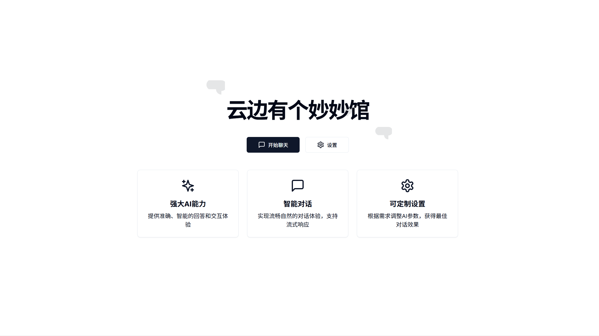
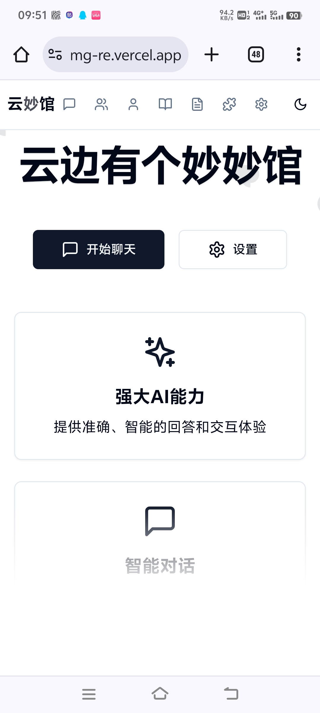

# 🎭 云边有个妙妙馆 - AI角色扮演平台

<div align="center">


一款支持 **Gemini API** 和 **OpenAI兼容端点** 的现代化AI角色扮演平台，提供高度自定义的聊天体验

[🚀 在线体验](https://ymg-re.vercel.app) · [📖 使用指南](#-使用指南) · [🐛 反馈问题](https://github.com/hcxmmx/YMG-re/issues)

</div>

---

## ✨ 核心特性

### 🎨 **角色系统**
- 🎭 **自定义AI角色** - 创建独特的AI角色，设定性格、背景和说话风格
- 📥 **角色卡导入** - 支持主流格式的角色卡导入导出，兼容社区资源
- 🎯 **多开场白** - 为每个角色设置多种开场白，丰富对话开始方式
- 🔗 **智能关联** - 角色与世界书、正则表达式的智能关联管理

### 💬 **聊天体验**  
- 🌊 **流式响应** - 实时显示AI回复，提供自然流畅的对话体验
- 🖼️ **图文混合** - 支持在对话中发送和处理图片，多模态交互
- ⌨️ **自定义快捷键** - 三种发送模式（Ctrl+Enter/Enter/Shift+Enter）满足不同习惯
- 🔄 **回复变体** - 一键生成多种回复选择，探索不同对话可能性
- 🌲 **分支对话** - 创建对话分支，保存关键决策点
- 🔍 **提示词调试** - 实时查看完整提示词构建过程，调试对话效果

### 📚 **知识管理**
- 📖 **世界书系统** - 构建详细的虚构世界知识库，智能触发背景信息
- 🎛️ **预设系统** - 保存和复用提示词模板，快速切换不同对话风格
- 🎮 **玩家系统** - 创建不同用户角色，支持多人设定
- 🏷️ **标签管理** - 为角色和内容添加标签，便于分类和检索

### 🔧 **扩展功能**
- 🔀 **正则表达式** - 强大的文本处理引擎，自动处理对话内容
- 📁 **文件夹组织** - 预设文件夹和角色文件夹分离，支持全局/局部作用域
- 🔑 **API密钥管理** - 多密钥轮询，提高服务稳定性
- 📊 **使用统计** - 跟踪API使用情况，合理分配资源
- 🌐 **多API支持** - 支持Gemini和OpenAI兼容端点，灵活切换AI服务
- 🔗 **连接测试** - 一键测试API连接状态并获取可用模型列表
- 💾 **模型缓存** - 智能缓存获取到的模型列表，提升使用体验

### 🎛️ **界面体验**
- 📱 **响应式设计** - 完美适配手机、平板、桌面等各种设备
- 🌙 **主题切换** - 支持亮色/暗色主题，保护视力
- 🎨 **字体定制** - 多种字体选择，自定义字体大小
- 💾 **PWA支持** - 可安装到设备，离线可用，原生应用体验

### 🔒 **数据安全**
- 🏠 **本地存储** - 所有数据存储在浏览器本地，保护隐私安全
- 📤 **数据导出** - 支持完整数据导出备份，防止数据丢失
- 📥 **批量导入** - 快速导入角色卡、预设、世界书等资源
- 🔄 **数据迁移** - 便捷的数据迁移和同步功能

---

## 🖼️ 界面展示

<div align="center">

| 桌面端界面 | 移动端界面 |
|:---:|:---:|
|  |  |

</div>

---

## 🚀 快速开始

### 💻 在线使用

直接访问 **[在线演示](https://ymg-re.vercel.app)** 即可开始使用，无需安装任何软件。

### 🛠️ 本地部署

#### 前置要求
- Node.js 18.0 或更高版本
- npm 或 yarn 包管理器

#### 安装步骤

1. **克隆仓库**
   ```bash
   git clone https://github.com/hcxmmx/YMG-re.git
   cd YMG-re
   ```

2. **安装依赖**
   ```bash
   npm install
   # 或使用 yarn
   yarn install
   ```

3. **启动开发服务器**
   ```bash
   npm run dev
   # 或使用 yarn
   yarn dev
   ```

4. **访问应用**
   
   在浏览器中打开 `http://localhost:3000`

#### 生产部署

```bash
# 构建生产版本
npm run build

# 启动生产服务器
npm start
```

---

## 📝 使用指南

### 🎯 初次设置

1. **配置API服务**
   - **Gemini API**: 进入 `扩展` → `API密钥` 页面，添加Gemini API密钥
   - **OpenAI兼容端点**: 进入 `设置` 页面，选择API类型为OpenAI，配置端点URL和密钥
   - 支持多种端点：OpenAI、OpenRouter、Groq、DeepSeek、自定义端点等
   - 可使用连接测试功能验证配置并获取可用模型列表

2. **个性化设置**
   - 进入 `设置` 页面调整主题、字体等偏好
   - 配置聊天快捷键（Ctrl+Enter/Enter/Shift+Enter）
   - 启用提示词调试功能（可选）

### 🎭 角色管理

1. **创建角色**
   - 访问 `角色管理` 页面
   - 点击 `新建角色` 按钮
   - 填写角色信息：名称、描述、头像、开场白
   - 可以设置多个备选开场白

2. **导入角色卡**
   - 支持导入 `.json` 格式的角色卡文件
   - 自动识别角色卡中的正则表达式并创建角色文件夹
   - 批量导入多个角色卡

3. **角色关联**
   - 为角色关联专属的世界书
   - 设置角色专用的正则表达式
   - 管理角色标签和分类

### 💬 开始对话

1. **选择角色**
   - 在角色列表中找到想要聊天的角色
   - 点击 `开始聊天` 按钮进入对话界面

2. **聊天功能**
   - 📝 **发送消息** - 输入文本并按快捷键发送
   - 🖼️ **发送图片** - 点击文件按钮上传图片
   - 🔄 **重新生成** - 对AI回复不满意时重新生成
   - 🌲 **创建分支** - 在关键对话点创建分支
   - ⚙️ **调整设置** - 实时调整温度、长度等参数

### 📚 高级功能

#### 🌍 世界书系统
- **创建知识库** - 构建角色的背景世界
- **智能触发** - 通过关键词自动插入相关信息
- **条目管理** - 设置激活策略、优先级、递归规则
- **关联角色** - 将世界书绑定到特定角色

#### 🎛️ 预设系统
- **保存模板** - 将常用的提示词保存为预设
- **快速切换** - 在不同预设间快速切换
- **正则关联** - 为预设关联特定的正则表达式文件夹
- **参数调优** - 为每个预设保存最佳参数

#### 🔀 正则表达式
- **文本处理** - 自动处理用户输入和AI回复
- **文件夹管理** - 使用文件夹组织正则脚本
- **作用域控制** - 区分全局正则和角色专用正则
- **实时测试** - 在编辑器中测试正则表达式效果

---

## 🛠️ 技术架构

### 核心技术栈
- **前端框架**: Next.js 14 (App Router)
- **UI库**: React 18 + TypeScript
- **样式**: Tailwind CSS + shadcn/ui
- **状态管理**: Zustand
- **数据存储**: IndexedDB (本地存储)
- **AI服务**: Google Gemini API + OpenAI兼容端点

### 关键特性
- **📱 PWA支持** - 可安装的Web应用
- **🔄 响应式设计** - 适配所有设备尺寸
- **⚡ 性能优化** - 代码分割、懒加载
- **🎨 组件化设计** - 可复用的UI组件
- **📊 状态管理** - 统一的应用状态
- **💾 数据持久化** - 可靠的本地存储

### 项目结构
```
├── app/                    # Next.js App Router页面
│   ├── api/               # API路由
│   ├── chat/              # 聊天界面
│   ├── characters/        # 角色管理
│   ├── worldbooks/        # 世界书管理
│   ├── presets/           # 预设管理
│   └── extensions/        # 扩展功能
├── components/            # React组件
│   ├── ui/               # 基础UI组件
│   ├── chat/             # 聊天相关组件
│   └── extensions/       # 扩展功能组件
├── lib/                  # 核心库文件
│   ├── storage.ts        # 数据存储
│   ├── store.ts          # 状态管理
│   ├── types.ts          # 类型定义
│   └── utils.ts          # 工具函数
└── public/               # 静态资源
```

---

## 🎮 使用场景

### 📖 创意写作
- **角色对话** - 与虚构角色进行深度对话，探索角色性格
- **剧情发展** - 通过分支对话探索不同故事线
- **世界构建** - 使用世界书系统构建详细的虚构世界

### 🎯 角色扮演
- **TRPG辅助** - 作为桌游角色扮演的AI助手
- **情景模拟** - 模拟各种对话场景和情境
- **角色练习** - 练习角色扮演和对话技巧

### 💼 实用助手
- **专业咨询** - 创建专业领域的AI助手
- **学习伴侣** - 定制化的学习和教育助手
- **语言练习** - 与AI角色进行语言对话练习

---

## 🔧 配置说明

### API服务配置

#### Gemini API设置
1. 获取 [Google AI Studio](https://ai.google.dev/) 的API密钥
2. 在`扩展` → `API密钥`页面添加密钥
3. 可配置多个密钥实现轮询和备份

#### OpenAI兼容端点设置
1. 在`设置`页面选择API类型为"OpenAI"
2. 选择端点类型（OpenAI、OpenRouter、Groq、DeepSeek等）或选择"自定义"
3. 填写对应的API密钥和端点URL
4. 使用连接测试功能验证配置
5. 系统会自动获取并缓存可用模型列表

### 性能优化建议
- **移动端使用** - 建议安装为PWA应用
- **大量数据** - 定期导出备份数据
- **网络优化** - 使用稳定的网络连接

### 隐私保护
- 所有对话数据仅存储在本地浏览器
- 不会上传到任何第三方服务器
- 定期清理浏览器数据前请先导出备份

---

## 🆕 更新日志

### 最新更新 (v1.1.0)

#### 🌐 多API支持
- ✅ **OpenAI兼容端点** - 支持OpenAI、OpenRouter、Groq、DeepSeek等多种AI服务
- ✅ **自定义端点** - 支持连接任意OpenAI兼容的API端点
- ✅ **连接测试** - 一键测试API连接状态和获取可用模型列表
- ✅ **智能配置** - 自动获取端点信息，支持预定义端点快速配置

#### 💾 模型缓存系统
- ✅ **持久化缓存** - 获取到的模型列表永久保存，无需重复获取
- ✅ **智能管理** - 按端点配置自动管理缓存，配置改变时自动清除
- ✅ **页面同步** - 设置页面和聊天设置页面的模型列表完全同步
- ✅ **用户体验** - 页面切换时模型列表不再丢失

#### 🔧 流式传输优化
- ✅ **配置统一** - 修复流式和非流式设置的配置矛盾问题
- ✅ **取消功能** - 修复自定义端点的请求取消功能
- ✅ **错误处理** - 增强对Cloudflare等反爬虫系统的应对
- ✅ **调试日志** - 添加详细的调试信息便于问题排查

### v1.0.0

#### 🎯 核心功能
- ✅ **自定义快捷键** - 支持三种发送快捷键模式
- ✅ **提示词调试** - 实时查看完整提示词构建过程
- ✅ **预设正则管理** - 新的两栏式预设-正则关联界面
- ✅ **移动端优化** - 优化移动设备上的操作体验

#### 🔧 系统改进
- ✅ **架构重构** - 改进SendMessageManager架构
- ✅ **默认预设** - 添加系统默认预设，替代"无预设"概念
- ✅ **文件夹管理** - 区分预设文件夹和角色文件夹
- ✅ **作用域优化** - 明确全局和局部正则作用域

#### 🎨 界面优化
- ✅ **设置分类** - 聊天设置按功能分类整理
- ✅ **响应式布局** - 更好的移动端布局适配
- ✅ **用户引导** - 添加功能使用指南和提示

---

## 🤝 贡献指南

我们欢迎社区贡献！如果你想为项目贡献代码：

### 🐛 报告问题
- 使用 [GitHub Issues](https://github.com/hcxmmx/YMG-re/issues) 报告bug
- 提供详细的复现步骤和环境信息
- 包含相关的截图或错误信息

### 💡 提出建议
- 在Issues中提出功能请求
- 详细描述期望的功能和使用场景
- 讨论技术实现方案

### 🔧 代码贡献
1. Fork 本仓库
2. 创建功能分支 (`git checkout -b feature/AmazingFeature`)
3. 提交变更 (`git commit -m 'Add some AmazingFeature'`)
4. 推送到分支 (`git push origin feature/AmazingFeature`)
5. 创建 Pull Request

### 📝 开发规范
- 使用 TypeScript 编写代码
- 遵循现有的代码风格
- 为新功能添加适当的注释
- 确保代码通过 ESLint 检查

---

## 🙏 致谢

- **[Google Gemini](https://ai.google.dev/)** - 提供强大的AI能力
- **[Next.js](https://nextjs.org/)** - 优秀的React框架
- **[shadcn/ui](https://ui.shadcn.com/)** - 美观的UI组件库
- **[Tailwind CSS](https://tailwindcss.com/)** - 实用的CSS框架
- **开源社区** - 提供了众多优秀的开源工具

---

## 📄 许可证

本项目采用 [知识共享署名-非商业性使用-相同方式共享 4.0 国际许可协议 (CC BY-NC-SA 4.0)](LICENSE) 进行许可。

这意味着：
- ✅ 可以自由使用、修改和分发（非商业用途）
- ✅ 可以用于个人学习、研究、教育
- ❌ **禁止商业用途** - 不得用于任何商业目的
- ❗ 必须署名并保留版权声明
- ❗ 衍生作品必须使用相同许可证

---

## 📞 联系我们

- **项目主页**: [GitHub Repository](https://github.com/hcxmmx/YMG-re)
- **在线演示**: [https://ymg-re.vercel.app](https://ymg-re.vercel.app)
- **问题反馈**: [GitHub Issues](https://github.com/hcxmmx/YMG-re/issues)

---

<div align="center">

**🎭 享受与AI角色的精彩对话吧！**

Made with ❤️ by AI Roleplay Community

</div>
